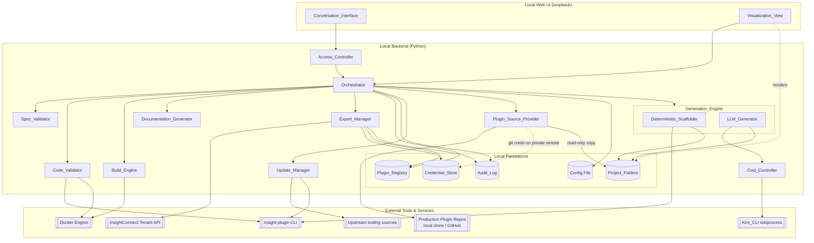
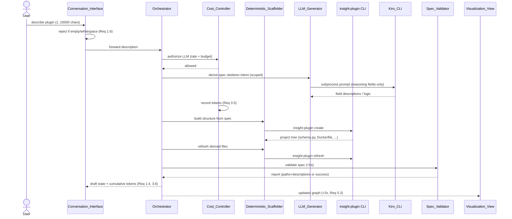
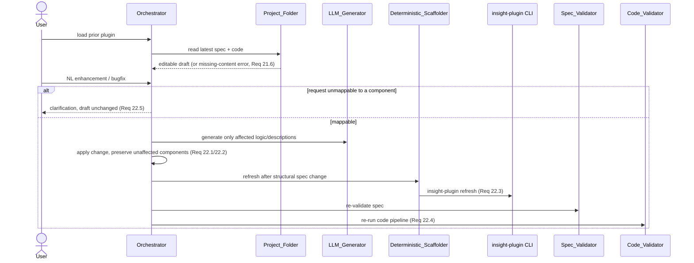
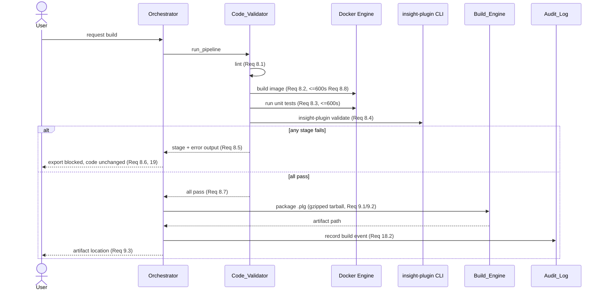
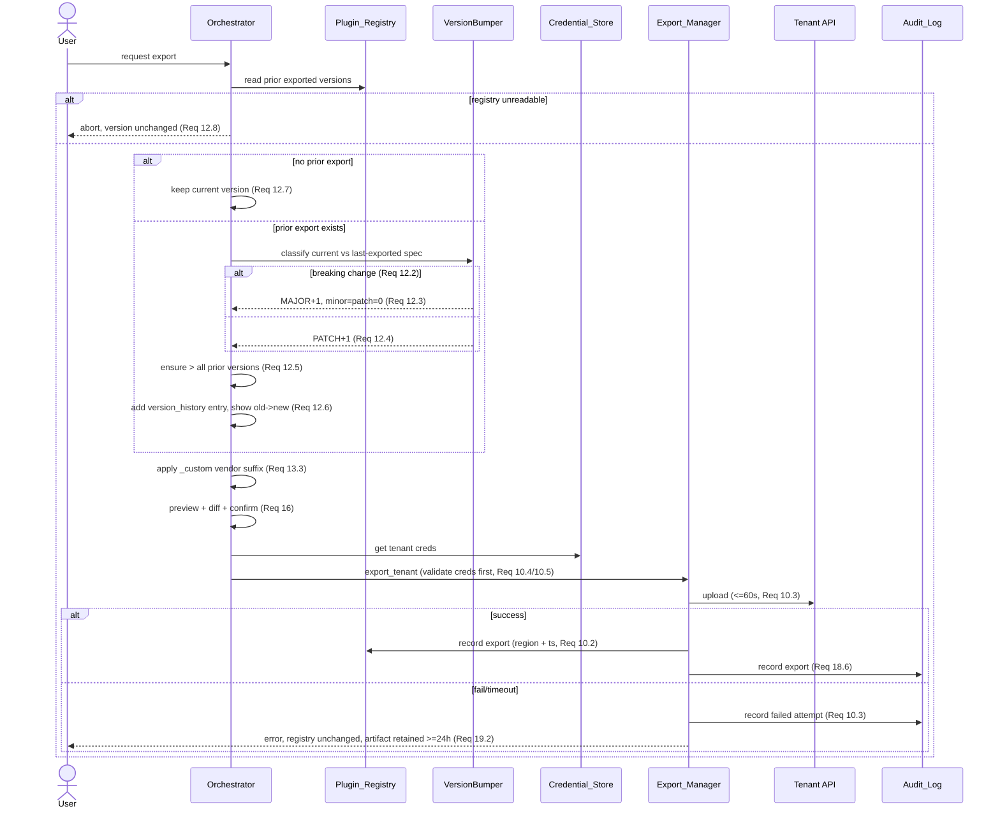
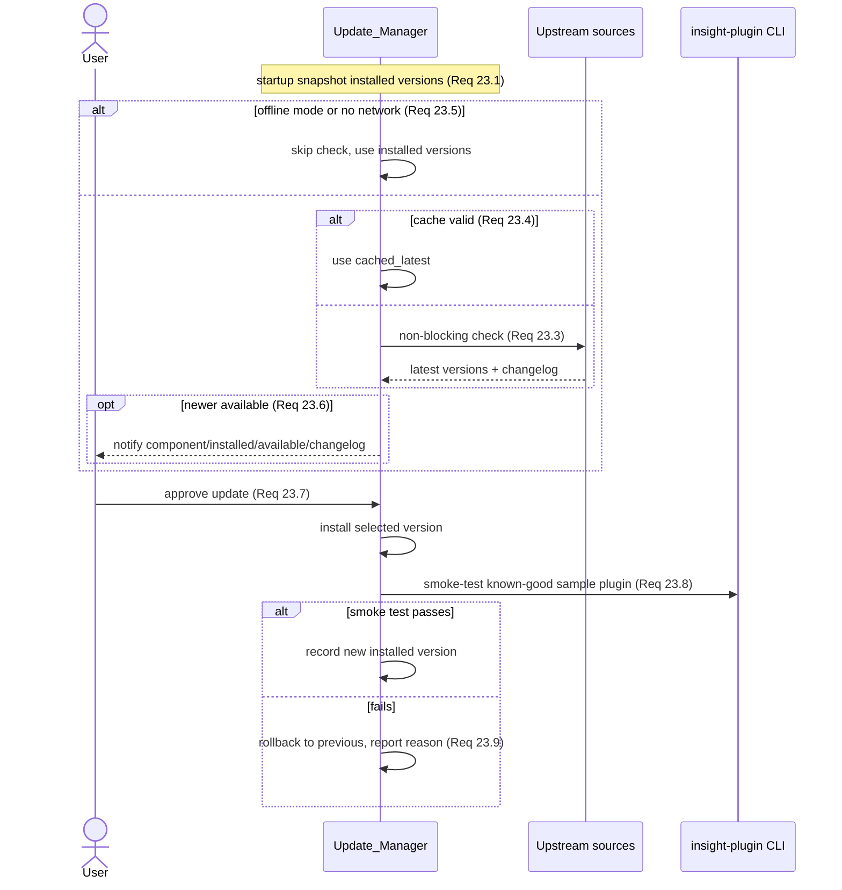
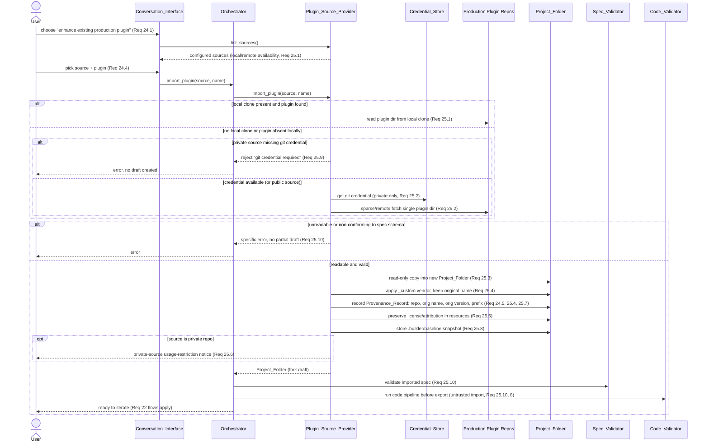

# Design Document

> **Revision note.** This design was substantially revised after the initial
> implementation. Its original central idea — a strict split in which the LLM
> emitted *text* for three narrow content types and the orchestrator assembled
> that text into files — is the reason the implemented tool produced unusable
> plugins, and it has been replaced. Sections describing persistence, versioning,
> credentials, audit, export, and entry modes were accurate and are unchanged.
> Where a superseded idea is retained below it is marked as such, with why.

## Overview

The InsightConnect Plugin Builder is a locally-run, single-user desktop-style application that turns natural-language descriptions into Rapid7 InsightConnect plugins that **work on first import**. It is a thin orchestration layer over the *real* InsightConnect toolchain — the `insight-plugin` CLI and the InsightConnect SDK — rather than a reimplementation of that toolchain. The `plugin.spec.yaml` file (plugin spec version `v2`) is the single source of truth for every plugin; all derived artifacts (`schema.py`, `__init__.py`, `Dockerfile`, `Makefile`, `setup.py`, `help.md`, `.CHECKSUM`) are produced deterministically by `insight-plugin refresh` and are never hand-edited.

The core strategy is **deterministic scaffolding plus delegated implementation**:

- Everything mechanical — the directory tree, the spec skeleton, the boilerplate, and every derived file — is produced by the `insight-plugin` CLI with zero LLM involvement. This half is unchanged from the original design and was correct.
- Everything hand-written — the connection, the API client, action/trigger/task logic, and the unit tests — is produced by the **Kiro CLI running as an agent** in the plugin's own working directory. It reads the spec, writes the interdependent files, runs the toolchain, reads the failures, and fixes them.

The original design instead had the LLM return snippets of Python which the orchestrator spliced into files. That cannot work, and the reason is worth stating because it is the single most important lesson in this document: **plugin source is not a set of independent snippets, and chat output is not a payload.** The action bodies call the API client, the connection constructs it, the tests mock it; correctness is a property of the set, established by running the toolchain over it. Requesting each piece separately and pasting the replies produced files that did not parse, and on occasion wrote the model's own deliberation into a plugin as code.

The agent's rulebook is the operator's own InsightConnect plugin skills and steering, referenced as agent resources. **The Plugin_Builder does not restate those rules.** It did once: a hand-maintained copy inside the prompt-building code drifted from the real steering, contradicting it on credential field types and hardcoding one specific vendor's API base URL into the prompt used for every plugin. One rulebook, read from where the operator maintains it, cannot drift.

Validation is **corrective**, not advisory. Running the checks and recording their results is necessary for the export gate but insufficient during construction: the original design did exactly that and reported a plugin with four unparseable files as built. A repair loop now submits located findings to the agent, re-checks, and repeats until they are resolved or it stops making progress — with a termination decision that is arithmetic and never delegated to a model.

The application:

- Runs entirely on the operator's machine or self-managed infrastructure with no hosted backend and no multi-user account model (Req 20).
- Binds to the loopback interface by default and offers an optional local passphrase guard (Req 17).
- Persists each plugin's work in a per-plugin `Project_Folder` for lookup, reuse, and resumption (Req 21), and records plugin/export metadata in a `Plugin_Registry` (Req 11).
- Stores tenant credentials encrypted at rest, reused across restarts, with explicit deletion (Req 14).
- Bumps versions in a schema-aware way (MAJOR on breaking change, PATCH otherwise) so tenant imports never collide (Req 12).
- Enforces per-session token budgets and per-user request rate limits with a live token counter (Req 4).
- Tracks the versions of its own managed tooling and applies upstream updates only on explicit approval with smoke-test + rollback (Req 23).

### Design Goals and Non-Goals

**Goals**
- Wrap, not replace, the InsightConnect toolchain; treat `plugin.spec.yaml` as authoritative.
- Minimize LLM token usage through a strict deterministic/LLM boundary, prompt scoping, template reuse, and caching.
- Be safe by default for a single local operator: loopback binding, encrypted credentials, masked secrets, append-only audit log.
- Preserve unaffected plugin content across every iteration and refresh.
- Support three entry modes at session start — create net-new, iterate on a previously created custom plugin, and enhance an existing production plugin — and treat production source repositories (public `rapid7/insightconnect-plugins` and private `komand-plugins`) as **read-only** import sources, forking a selected plugin into a fresh custom lineage without altering or colliding with the production original (Req 24, 25).

**Non-Goals**
- No hosted/multi-tenant service, no user account system, no RBAC beyond a single optional passphrase.
- No reimplementation of `insight-plugin` scaffolding or SDK behavior.
- No autonomous tooling upgrades.

## Architecture

### Component Diagram



### Layered View

1. **Presentation layer** — a local web UI served on the loopback interface: a chat panel (`Conversation_Interface`) and a live plugin graph (`Visualization_View`).
2. **Orchestration layer** — an `Orchestrator` that sequences conversation turns, generation, validation, build, export, and version bumping. It is the single place that enforces ordering guarantees (e.g. "validate before export", "refresh after spec edit").
3. **Domain services** — `Generation_Engine` (with `Deterministic_Scaffolder` + `LLM_Generator`), `Spec_Validator`, `Code_Validator`, `Build_Engine`, `Export_Manager`, `Documentation_Generator`, `Cost_Controller`, `Update_Manager`, `Access_Controller`, `Plugin_Source_Provider` (resolves and read-only-imports production plugins for the enhance-existing entry mode).
4. **Persistence layer** — `Project_Folder`s (on-disk plugin working trees), `Plugin_Registry`, `Credential_Store`, `Audit_Log`, and a config file.
5. **External integrations** — the Kiro CLI (LLM), the `insight-plugin` CLI, the Docker engine, the InsightConnect tenant API, upstream tooling sources, and the production plugin repositories (local clones of `rapid7/insightconnect-plugins` and `komand-plugins`, with GitHub as a remote fallback).

### Recommended Technology Stack

**Backend: Python 3.11+.** The entire InsightConnect ecosystem — the `insight-plugin` CLI, the SDK, and generated plugin code — is Python. Matching that ecosystem means the tool can import SDK helpers, shell out to `insight-plugin` cleanly, parse `plugin.spec.yaml` with the same YAML semantics, and run generated unit tests in-process where useful. Using any other backend language would add an impedance mismatch at every integration point.

- **Web framework:** FastAPI (ASGI) with Uvicorn, bound to `127.0.0.1` by default. FastAPI gives typed request/response models, easy WebSocket support for streaming chat and live graph updates, and a small dependency footprint suitable for a local single-user app.
- **Real-time updates:** WebSocket channel for streaming generation progress, token counter, and visualization updates (satisfies the 2-second visualization refresh in Req 5.3 without polling).
- **Subprocess management:** Python `asyncio.create_subprocess_exec` for invoking the Kiro CLI and `insight-plugin`, with timeouts (Req 8.8's 600s stage cap, Req 1.2's 30s draft cap, Req 10.3's 60s upload cap).
- **YAML/schema:** `ruamel.yaml` (round-trip-preserving) for `plugin.spec.yaml` so comments/ordering survive edits; `jsonschema` (or the InsightConnect spec schema, if published) for structural validation.
- **Encryption:** the `cryptography` library — Fernet (AES-128-CBC + HMAC) with a key derived via scrypt/PBKDF2 from an OS keyring secret or the optional passphrase (see Security).

**Frontend: a local single-page web UI (TypeScript + React).** A browser-based UI is the pragmatic choice for a rich chat + interactive graph experience while remaining cross-platform and dependency-light for the operator (no native GUI toolkit to install).

- **Graph rendering:** React Flow (node/edge graph) for the `Visualization_View` — connection, actions, triggers, tasks as nodes; input/output schema fields shown on node expansion/selection. React Flow handles selection, panning, and detail panels needed by Req 5.2/5.4.
- **Chat UI:** a standard message-list + input component wired to the WebSocket.
- **Packaging:** the UI is built to static assets and served by the FastAPI backend, so the operator launches a single process and opens `http://127.0.0.1:<port>`.

**Distribution:** a Python package (`pipx install`) or a self-contained runner. The UI ships pre-built inside the package.

**Docker dependency.** The build and validate stages (Req 8.2 build container image, Req 8.4 `insight-plugin validate`, Req 9 packaging) require the Docker engine because InsightConnect plugins are container images and `.plg` artifacts are built from them. The design treats Docker as an **optional-at-startup, required-for-build** dependency:

- At startup the tool probes for a working Docker engine (`docker version`) and records availability.
- If Docker is **absent or not running**, conversation, generation, spec validation, visualization, documentation, and project history all continue to work (they need no container). Only the build/validate/package/tenant-export path is gated.
- When the user requests a build without Docker available, the `Build_Engine`/`Code_Validator` returns a clear, actionable error ("Docker engine not detected; start Docker Desktop / the daemon to build and validate") and does not partially build (aligns with Req 19 error handling and Req 20.4 local-build support "where tenant API access is unavailable" — here the analogous graceful degradation applies to Docker).
- The lint stage (Req 8.1) runs without Docker where the linters are Python packages, so partial validation feedback is still available offline.

### Orchestrator Responsibilities

The `Orchestrator` is deliberately the only component that mutates the draft and sequences side effects, which makes the workflow invariants testable in one place:

- Establishes the session's **entry mode** at start (create net-new, iterate on a previously created custom plugin, or enhance an existing production plugin), routing net-new to an empty draft, iterate to the `Project_Folder` list, and enhance to the `Plugin_Source_Provider`; it records a `Provenance_Record` for the resulting draft regardless of entry mode (Req 24.1–24.5).
- Holds the in-session **draft** (current `Plugin_Spec` + working code tree path).
- Routes each conversation turn to either the `Deterministic_Scaffolder` or `LLM_Generator` based on the deterministic/LLM decision boundary (below).
- Guarantees post-edit `insight-plugin refresh` runs whenever the spec's structural surface changes (Req 22.3).
- Enforces "spec valid AND code valid" before enabling export (Req 7.4, 8.6, 8.7).
- Enforces the version-bump decision before a build that follows a prior export (Req 12).
- Emits audit events for security/export-relevant actions (Req 18).

## Components and Interfaces

Interfaces below are expressed as Python-ish signatures for clarity; exact typing is an implementation detail.

### Conversation_Interface
- `select_entry_mode(session_id) -> EntryModeChoice` — at session start presents exactly three entry modes: create a net-new plugin, iterate on a previously created custom plugin, and enhance an existing production plugin (Req 24.1). Net-new begins an empty draft (Req 24.2); iterate lists `Project_Folder` plugins for selection and loads the chosen one into an editable draft (Req 24.3); enhance prompts for a `Production_Plugin_Source` and a plugin within it (Req 24.4), delegating to the `Plugin_Source_Provider`. Whatever the mode, a `Provenance_Record` identifying the entry mode is recorded for the created draft (Req 24.5).
- `submit_message(session_id, text) -> TurnResult` — validates length 1..10,000 (Req 1.1); rejects empty/whitespace-only input leaving the draft unchanged (Req 1.6); on ambiguity returns a clarification prompt identifying the specific ambiguity (Req 1.5, 15.4, 22.5); otherwise forwards to the `Orchestrator`.
- Streams draft state to the UI when a generation step completes (Req 1.4) and surfaces the cumulative token counter (Req 3.6). When the active draft was forked from the private production repository, surfaces the private-source usage-restriction notice (Req 25.6).

### Generation_Engine
Splits every requested artifact into a **classification** — `directory_structure | spec_skeleton | boilerplate | action_logic | field_description | help_text | template_match` — and dispatches accordingly.

- `Deterministic_Scaffolder`
  - `create(spec) -> ProjectTree` → `insight-plugin create`
  - `refresh(project) -> ProjectTree` → `insight-plugin refresh` (regenerates `schema.py`, `__init__.py`, `Dockerfile`, `Makefile`, `setup.py`, `help.md`, `.CHECKSUM`) (Req 3.1, 22.3)
  - Makes **zero** LLM invocations (Req 3.1).
- `Plugin_Agent`
  - `implement(project_dir, instruction) -> AgentRunResult` — runs the Kiro CLI as an agent with the plugin directory as its working directory, its granted tools enumerated explicitly, its prompt on stdin, and a default-deny environment (Req 3.4, 29). Returns the agent's closing report, the observed change set, and the reported credits. Every call goes through `Cost_Controller.authorize()` first.
  - The instruction is a *task*. The standing rules and the Definition_Of_Done live in the agent configuration; the plugin-authoring rules live in the `Agent_Rulebook` the configuration references. Nothing paraphrases them here (Req 20.7).
- `LLM_Generator`
  - `generate(kind, scoped_context) -> Content` where `kind ∈ {field_description, help_text}` — prose only, never source (Req 3.7). Invoked via the Kiro CLI subprocess, cost-gated identically.
  - `TemplateLibrary.match(request) -> Optional[Template]` — a prose request matching a known pattern renders from a template with zero LLM calls (Req 3.8).
- `Quality_Gate`
  - `run(project_dir) -> QualityReport` — parses every hand-written Python file, checks formatting, runs the linter, runs the unit tests, and measures coverage of the plugin package, producing located `Finding`s and excluding generated files (Req 26.1–26.3). A check whose tool is missing is reported as skipped, never as passed (Req 26.4).
  - Runs no containerized stage: these checks complete in seconds, which is what makes iterating viable. The four-stage `Code_Validator` remains the authoritative pre-export gate.
- `Repair_Loop`
  - `run(project_dir, fixer) -> RepairOutcome` — checks, submits findings for repair, re-checks, and stops on clean, stalled, or round-limit (Req 26.5–26.9). The decision is finding-key arithmetic; a fixer's account of its own success is not an input.

### Spec_Validator
- `validate(spec) -> ValidationReport` — structural validation against the InsightConnect plugin spec schema within 5s (Req 7.1); semver check on `version` (Req 7.3, 7.5); returns every error with a field path + description (Req 7.2); success indication when clean (Req 7.6). A failing report blocks export (Req 7.4).

### Code_Validator
- `run_pipeline(project) -> PipelineReport` — runs four stages, each recording pass/fail: lint (Req 8.1), Docker build (Req 8.2), unit tests (Req 8.3), `insight-plugin validate` (Req 8.4). Build/test stages abort at 600s with a timeout fail (Req 8.8). Any fail → export blocked, code retained unchanged (Req 8.6); all pass → export permitted (Req 8.7).

### Build_Engine
- `package(project) -> PlgArtifact` — only when validation passed (Req 9.1, 9.4); produces a gzipped tarball `.plg` (Req 9.2); on packaging failure produces no partial artifact and leaves sources unchanged (Req 9.5).

### Export_Manager
- `export_local(project) -> path` — writes `.plg` to a user-accessible output location and reports the path (Req 9.3).
- `export_tenant(project, tenant_creds) -> ExportResult` — validates non-empty region base URL + API key before contacting the API (Req 10.4); rejects if no built artifact exists (Req 10.5); uploads via the InsightConnect API (Req 10.1); on success records the export in the registry with region + timestamp (Req 10.2); on failure/timeout(60s) reports error, logs the failed attempt to the audit log, leaves the registry unchanged, and retains the artifact ≥24h for retry (Req 10.3, 19.2).

### Documentation_Generator
- `generate_help(spec) -> help_md` — sections for connection/actions/triggers/tasks (Req 6.1); every action/trigger input+output field with name, type, required/optional (Req 6.2); title/description/version/vendor (Req 6.3); empty categories render a heading + placeholder rather than being omitted (Req 6.4); aborts and leaves existing `help.md` unchanged if required metadata missing (Req 6.5). In practice this is produced by `insight-plugin refresh`; the generator wraps/verifies that output.

### Cost_Controller
- `authorize(session_id, user_id) -> Decision` — enforces per-minute request rate limit 1..1000 (Req 4.4, 4.5, returning the retry-after seconds on rejection) and per-session token budget 1..10,000,000 default 100,000 (Req 4.1, 4.2, 4.6). When budget is reached it blocks further LLM calls, keeps completed output, persists no partial result (Req 4.2), and returns the budget-reached message (Req 4.3).
- `record_usage(session_id, tokens) -> total` — adds token count to the session total after a successful invocation (Req 3.5); failed invocations are excluded (Req 3.7).

### Update_Manager
- `snapshot_installed() -> ToolingVersions` at startup (Req 23.1).
- `check_upstream() -> Optional[Updates]` — non-blocking, cached for a configurable duration, skipped in offline mode (Req 23.3, 23.4, 23.5); notifies with component/installed/available/changelog on newer versions (Req 23.6).
- `apply_update(component, version) -> ApplyResult` — only on explicit approval (Req 23.7); installs, runs a smoke test against a known-good sample plugin, records new version only on pass (Req 23.8), rolls back on failure with reason (Req 23.9).
- `offer_sdk_bump(project) -> Offer` — when a loaded plugin's pinned SDK is behind the latest known-good SDK, offers a bump on next refresh, leaving the pin unchanged unless approved (Req 23.10).

### Access_Controller
- `authenticate(passphrase) -> Session` — when protection enabled, requires the configured passphrase (Req 17.1); denies on mismatch and runs no protected function (Req 17.2); when disabled, grants access without prompting (Req 17.3). Records auth success/failure to the audit log (Req 18.1, 18.5).

### Plugin_Source_Provider
Resolves, lists, and read-only-imports production plugins for the "enhance an existing production plugin" entry mode. A `Production_Plugin_Source` is one of the configured repositories (public `rapid7/insightconnect-plugins`, private `komand-plugins`), each resolved **local clone first, remote GitHub fallback second**.
- `list_sources() -> [ProductionPluginSource]` — returns the configured production sources with, for each, whether a local clone path is configured and reachable and whether a remote fallback is available (Req 25.1).
- `list_plugins(source) -> [ProductionPluginRef]` — enumerates plugins in the selected source. Reads from the configured local clone when present (Req 25.1); when no local clone is configured or the requested plugin is absent locally, resolves the plugin from the remote source, using stored git credentials for the private repository and a sparse/single-directory fetch for the large monorepo (Req 25.2). If a required git credential for the private repository is missing on a remote fetch, rejects with a "git credential required" error and imports nothing (Req 25.9).
- `import_plugin(source, name) -> Project_Folder` — copies the selected plugin directory into a **new** `Project_Folder` and never writes to the `Production_Plugin_Source` (read-only invariant, Req 25.3). On import it: applies the `Custom_Vendor_Suffix` (`_custom`) to the vendor while **retaining the original plugin name** (Req 25.4); records a `Provenance_Record` capturing the entry mode, source repository, original plugin name, and original version (Req 24.5, 25.4); preserves the original license/attribution references in `resources` (`source_url` / `license_url`) (Req 25.5); detects and records the package prefix, accepting both the current `icon_` and legacy `komand_` prefixes (Req 25.7); stores a read-only **baseline snapshot** (original production spec + code) under `.builder/baseline/` for later fork-baseline diffs (Req 25.8); and flags a private-source usage-restriction notice when the source is the private repository (Req 25.6). Imported production content is untrusted: the resulting draft still passes `Spec_Validator` and `Code_Validator` before export (Req 25.10, 8). If the selected plugin cannot be read or does not conform to the plugin-spec schema, reports the specific error and creates no partial draft (Req 25.10).
- `baseline_diff(project) -> Diff` — computes the difference between the current draft and the stored `.builder/baseline/` production baseline for enhanced forks (Req 25.8). This is independent of the general prior-version diff of Req 16, which diffs against the previously exported version in the `Plugin_Registry`.
- `offer_sdk_bump` (via `Update_Manager`, Req 23.10) applies to imported production plugins whose pinned SDK is behind the latest known-good SDK.

### Plugin_Registry / Credential_Store / Audit_Log
Interfaces detailed under Data Models.

## Deterministic / Delegated Decision Boundary

This boundary is the heart of the design (Req 3) and, together with the
`Cost_Controller`, is what keeps cost visible (Req 4).

**Deterministic (zero LLM involvement):**
- Directory structure, `plugin.spec.yaml` skeleton, and all boilerplate → `insight-plugin create`, invoked from the **parent** of the plugin directory. It always creates a subdirectory named after the plugin, and it declines to run over an existing directory *while still exiting zero* — so success is judged by whether the tree appeared, never by exit status (Req 3.2, 3.3).
- All derived files (`schema.py`, `__init__.py`, `Dockerfile`, `Makefile`, `setup.py`, `help.md`, `.CHECKSUM`) → `insight-plugin refresh`.
- Version arithmetic, `_custom` vendor suffixing, semver validation, spec completeness, diffing, packaging — pure functions.
- The repair loop's termination decision — finding-key set arithmetic (Req 26.6).

**`create` and `refresh` are not interchangeable.** From byte-identical specs, `create` produces the current `icon_` package prefix while `refresh` against a directory holding only a spec produces the legacy `komand_` one. The original implementation used only `refresh`, which is why every plugin it built carried the legacy prefix. The prefix is read back off the scaffolded tree rather than assumed, because assuming it produced metadata that contradicted what was on disk.

**Delegated to the Plugin_Agent (Kiro CLI with tools, in the plugin directory):**
- `connection/connection.py`, `util/api.py`, `util/constants.py`, `actions/*/action.py`, `triggers/*`, `tasks/*`, and `unit_test/*`.
- Repair of Quality_Gate findings.

The agent is granted file-read, file-write, search, and **shell** — shell because the plugin workflow is defined in terms of running `insight-plugin`, the linter, and the tests, and an agent that cannot run them cannot verify its own work. Tools are enumerated explicitly rather than blanket-trusted (Req 29.4).

**Prose only, via the LLM_Generator as a text completion:**
- Field descriptions and help-text prose. These are self-contained and have no dependency on the working tree.

### What is not carried over

> **Superseded: prompt scoping.** The original design gave the LLM "only the
> relevant slice of the spec … never the whole project tree", as a token measure.
> The agent now reads whatever it needs from the tree it is working in, which is
> the point of delegating. Scoping remains for the prose path, where it is
> genuinely sufficient.

> **Superseded: the TemplateLibrary as a primary mechanism.** Parameterized
> templates for common patterns (paginated list, single-resource GET, webhook
> trigger) were meant to avoid LLM calls for whole actions. In practice a template
> match requires the caller to already know the pattern, and no code path supplies
> one for code artifacts. The library is retained for prose (Req 3.8) and the
> deterministic-render path is real, but it is not load-bearing for code, and it
> should not be presented as though it were.

> **Superseded: memoization of generation requests.** Identical scoped requests
> reusing a prior result made sense for stateless text completions. An agent
> invocation mutates a working tree, so replaying a cached result would be
> incorrect.

### Cost accounting

Every delegated invocation passes through `Cost_Controller.authorize()` before dispatch and is recorded afterwards, and a failed invocation is excluded from the total (Req 3.9, 3.13).

The Kiro CLI reports usage as **credits, on stderr** — not as a token count on stdout. Two consequences the original design did not anticipate:

1. A reported-token path that looks for a usage figure on stdout never fires for this provider. It is retained for provider independence but must not be read as meaning the totals are exact.
2. The token figure recorded against the session budget is a **floor, not a measurement**: it covers the instruction and the transcript and cannot see the file contents the agent chose to read. It bounds the budget monotonically, which is what Req 4 needs of it. Credits are the number to look at for real spend, and an unreported figure is represented as unknown rather than as zero (Req 3.11, 3.12).

**Token accounting with the Kiro CLI.** Because the Kiro CLI subprocess may not reliably return exact token counts, the `Cost_Controller` measures usage with the following precedence and records which method was used:
1. If the Kiro CLI emits a machine-readable usage figure (e.g. structured JSON on stdout or a usage line), use the reported value.
2. Otherwise, **estimate** tokens from the prompt + completion text using a tokenizer approximation (character/word-based heuristic, ~4 chars/token, or a bundled tokenizer if the model family is known), and flag the total as an estimate in the UI.
The cumulative session total is always a non-negative integer (Req 3.6) and the budget check applies whichever figure is available. This keeps the budget conservative even when exact counts are unavailable.

## Data Models

### Plugin_Spec (in-memory representation)

Mirrors `plugin.spec.yaml` (`plugin_spec_version: v2`). Modeled as a typed tree so diffing and breaking-change classification are exact:

```
PluginSpec
  plugin_spec_version: "v2"
  name: str                 # snake_case, matches Project_Folder dir name
  title: str
  description: str
  version: SemVer           # MAJOR.MINOR.PATCH
  connection_version: int
  vendor: str               # ends with "_custom" on export
  support: str
  sdk: { type, version, user, ... }
  supported_versions: [str]
  version_history: [str]
  key_features: [str]
  requirements: str | obj
  resources: obj
  tags: [str]
  hub_tags: { products, vendors, use_cases, keywords }
  types: { <type_name>: { <field>: FieldSchema } }
  connection: { <field>: FieldSchema }
  actions:  { <name>: Component }
  triggers: { <name>: Component }
  tasks:    { <name>: Component }

Component
  title, description: str
  input:  { <field>: FieldSchema }
  output: { <field>: FieldSchema }

FieldSchema
  title, description: str
  type: str                 # string|integer|float|boolean|bytes|date|password
                            # |object|[]string|[]<type>
                            # |credential_secret_key|credential_username_password
                            # |credential_asymmetric_key
  required: bool
  default, example, placeholder, tooltip: any
  order: int
  enum: [any]
```

`SemVer` is `(major, minor, patch)` with a total order used throughout version bumping.

### Project_Folder (on-disk layout)

One directory per plugin, named by the plugin `name` (snake_case). This is the durable working tree and history store (Req 21).

```
<projects_root>/<plugin_name>/
  plugin.spec.yaml                 # source of truth (current draft)
  icon_<plugin_name>/ | komand_<plugin_name>/   # package (prefix per SDK era)
    actions/<name>/action.py       # hand-written logic
    triggers/<name>/trigger.py
    tasks/<name>/task.py
    connection/connection.py
    util/ (api.py, constants.py)
    schema.py __init__.py          # generated (never hand-edited)
  Dockerfile Makefile setup.py     # generated
  help.md                          # generated docs
  .CHECKSUM                        # generated
  unit_test/
  .builder/                        # tool-owned metadata (not part of the plugin)
    project.json                   # { plugin_name, current_version, created_utc, last_modified_utc, package_prefix, provenance: Provenance_Record }
    tooling.json                   # per-build stamps: { version -> { insight_plugin_cli, sdk_version, kiro_cli, spec_schema } }
    baseline/                      # present only for production-fork drafts (entry mode = enhance_production)
      plugin.spec.yaml             # read-only snapshot of the imported production spec (fork baseline)
      <package>/ ...               # read-only snapshot of the imported production code tree
    history/
      <version>/
        plugin.spec.yaml           # snapshot of the exported/built spec at this version
        export_outcome.json        # { target, timestamp_utc, result, message }
    artifacts/
      <plugin_name>-<version>.plg  # retained built artifacts (>=24h on export failure)
```

The `.builder/` subtree holds tool-only metadata so it never leaks into the plugin or `.plg` (Req 14.3). For production forks, `.builder/baseline/` stores the original imported production spec + code as an immutable reference so `Plugin_Source_Provider.baseline_diff` can compute the fork-vs-original diff (Req 25.8) at any time, independent of the exported-version diff maintained under `history/` (Req 16).
### Provenance_Record
Recorded for every draft regardless of entry mode (Req 24.5) and stored in `.builder/project.json`. Captures how the draft originated so forks carry an auditable lineage distinct from any tenant plugin.
```
Provenance_Record
  entry_mode: "create_new" | "iterate_custom" | "enhance_production"   # Req 24.1
  created_utc: str                    # ISO-8601 UTC
  # present only when entry_mode == "enhance_production" (Req 25.4):
  source_repo: str                    # e.g. "rapid7/insightconnect-plugins" | "komand-plugins"
  source_visibility: "public" | "private"
  source_location: "local_clone" | "remote_github"   # how it was resolved (Req 25.1, 25.2)
  original_plugin_name: str           # retained as the draft name (Req 25.4)
  original_version: SemVer            # version at import time
  original_package_prefix: "icon_" | "komand_"   # Req 25.7
```
A production fork is a **fresh custom lineage**: the vendor gains `_custom` (Property 26 / Req 13, 25.4) while the original name is kept, so version bumping (Req 12) proceeds independently of the production original and never collides in a tenant.

### Plugin_Registry

Persistent, survives restarts (Req 11.3). A single local store (SQLite recommended for atomic writes and ordered queries; a JSON file is an acceptable fallback). Schema:

```
plugins(
  plugin_name TEXT PRIMARY KEY,
  vendor TEXT,               # stored with _custom as exported
  current_version TEXT,
  created_utc TEXT           # ISO-8601 UTC
)

exports(
  id INTEGER PK,
  plugin_name TEXT REFERENCES plugins,
  version TEXT,              # exported SemVer
  target TEXT,               # 'local' | tenant region base URL
  export_utc TEXT,           # ISO-8601 UTC
  result TEXT                # 'success' | 'failed'
)
```

- Creation records name/vendor/version/created_utc (Req 11.1); export records version/target/timestamp (Req 11.2). Only successful tenant uploads are recorded as exports (Req 10.2); failed uploads go to the audit log and leave the registry unchanged (Req 10.3).
- History query returns versions + export events most-recent-first (Req 11.4); empty history returns an empty result, not an error (Req 11.5). Write failures return an error and preserve prior history (Req 11.6).
- The set of previously exported versions per plugin is the input to version-bump monotonicity (Req 12.5).

### Credential_Store

Encrypted-at-rest secret store on the local filesystem (Req 14).

```
<config_root>/credentials.enc     # ciphertext blob
  entries: {
    <credential_id>:     { kind: "tenant_api", region_base_url, api_key_ciphertext, created_utc },
    <git_credential_id>: { kind: "git", host, username, token_ciphertext, created_utc }  # private-repo remote fallback (Req 25.2)
  }
```

- Encryption via Fernet with a key derived from an OS keyring entry or the optional passphrase (scrypt KDF). No plaintext is retained after a store op (Req 14.1). Available for reuse after restart without re-entry (Req 14.2). Deletion removes the entry entirely, retaining no plaintext or ciphertext copy (Req 14.5). If encryption fails, the store op is rejected with nothing partially written (Req 14.6).
- Secrets are excluded from visualization, docs, and `.plg` (Req 14.3) and masked with a fixed placeholder wherever displayed or logged (Req 14.4).
- Git credentials for the private production repository (`komand-plugins`) reuse this same encrypted store and masking guarantees, and are read only by the `Plugin_Source_Provider` when a remote fetch of the private source is required (Req 25.2). A remote private-repo fetch attempted without the required git credential is rejected before any network call with a "git credential required" error (Req 25.9).

### Audit_Log

Append-only, integrity-protected record (Req 18).

```
<config_root>/audit.log            # append-only, one record per line
record = {
  seq: int,                        # monotonic
  event: str,                      # auth_success | auth_failure | build | export | credential_store | credential_use
  utc: str,                        # ISO-8601 UTC, >= second precision
  plugin_name?: str, version?: str,
  user_identity?: str, reason?: str,
  target?: str,
  prev_hash: str, hash: str        # hash chain over (prev_hash + serialized record)
}
```

- Records auth success/failure (Req 18.1, 18.5), build (Req 18.2), export (Req 18.6), and credential store/use with masked secret values (Req 18.3). Append-only with ≥90-day retention (Req 18.4). A hash chain makes alteration/deletion of a prior record detectable and the write path rejects in-place edits (Req 18.7).

### Config File

Read at startup; missing/invalid required settings halt startup with a specific error (Req 20.2, 20.6).

```yaml
llm:
  provider: kiro_cli          # primary provider (Req 20.3)
  kiro_cli_path: /usr/local/bin/kiro
cost:
  token_budget: 100000        # 1..10_000_000, default 100000 (Req 4.1, 4.6)
  rate_limit_per_min: 60      # 1..1000 (Req 4.4)
network:
  bind_address: 127.0.0.1     # default loopback (Req 17.4)
  port: 8787
access:
  protection_enabled: false   # (Req 17)
  passphrase_hash: null       # argon2/scrypt hash when enabled
paths:
  projects_root: ~/.icplugin-builder/projects
  config_root: ~/.icplugin-builder
updates:
  offline_mode: false         # (Req 23.5)
  check_interval_hours: 24
  cache_ttl_hours: 24         # (Req 23.4)
tenant:
  default_region_base_url: null
production_sources:              # (Req 24.4, 25.1, 25.2)
  - id: rapid7_public
    repo: rapid7/insightconnect-plugins
    visibility: public
    local_path: ~/src/insightconnect-plugins   # local clone preferred; null -> remote GitHub fallback
    remote_url: https://github.com/rapid7/insightconnect-plugins.git
    git_credential_id: null                     # not required for the public repo
  - id: komand_private
    repo: komand-plugins
    visibility: private
    local_path: null                            # when null/absent -> remote fetch (Req 25.2)
    remote_url: https://github.com/komand-plugins.git
    git_credential_id: komand_git               # references a Credential_Store git entry (Req 25.2, 25.9)
```

### Update_Manager Version Records

```
<config_root>/tooling_state.json
{
  installed: { insight_plugin_cli, sdk_version, kiro_cli, spec_schema },
  last_check_utc: str,
  cached_latest: { <component>: { version, changelog_url } },
  cache_expires_utc: str,
  known_good_sdk: str
}
```

Each build additionally stamps the tooling versions used into the project's `.builder/tooling.json` (Req 23.2).

## Key Flows

### Flow 1: Create a New Plugin



### Flow 2: Iterate on an Existing Plugin



### Flow 3: Build + Validate Pipeline



### Flow 4: Export to Tenant with Schema-Aware Version Bump



### Flow 5: Tooling Update Check + Apply



### Flow 6: Enhance a Production Plugin

## Security Design

- **Loopback binding by default.** The server binds `127.0.0.1` unless configured otherwise (Req 17.4), so the tool is not network-exposed out of the box. Binding to a non-loopback address is an explicit operator choice.
- **Optional local access guard.** When `access.protection_enabled` is true, the `Access_Controller` requires the configured passphrase before any protected function runs; a wrong passphrase denies access and executes nothing (Req 17.1, 17.2). The passphrase is stored only as a salted argon2/scrypt hash, never in plaintext.
- **Credential encryption.** Tenant API keys are encrypted with Fernet (authenticated AES) using a key derived (scrypt) from an OS keyring secret or the access passphrase. Plaintext exists only transiently in memory during a store/use operation and is never written to disk (Req 14.1, 14.6). Deletion purges both plaintext and ciphertext (Req 14.5).
- **Secret masking.** A single masking routine replaces every character of any secret with a fixed placeholder before it can reach the UI, logs, docs, or `.plg` (Req 14.3, 14.4, 18.3). Masking is applied at the boundary so no code path can accidentally emit a raw secret.
- **Append-only audit integrity.** The `Audit_Log` is append-only and hash-chained (each record hashes the previous record's hash). Any attempt to alter or delete a prior record is rejected and detectable via chain verification (Req 18.4, 18.7).
- **Untrusted external content.** Output from the Kiro CLI, the tenant API, imported `.plg`/spec files, imported production plugins, and upstream update sources is treated as untrusted data: imported specs are schema-validated before becoming a draft (Req 2.4, 25.10), and generated or imported code is linted/built/tested/validated before export (Req 8, 25.10).
- **Read-only production sources.** The `Plugin_Source_Provider` only ever *reads* from a `Production_Plugin_Source`; enhancement forks a plugin by copying its directory into a new `Project_Folder`, and no code path writes back to the local clone or the remote repository (Req 25.3). For the large monorepo, a single plugin directory is selected (sparse fetch on remote) rather than cloning the whole tree.
- **Git credentials for private sources.** Credentials for the private `komand-plugins` repository are stored in the same encrypted `Credential_Store` and masked identically to tenant secrets; they are used only to fetch from the private remote when no local clone is available (Req 25.2). A missing credential rejects the fetch before any network call (Req 25.9).
- **Private-source usage notice.** When a plugin is imported from the private repository, the UI displays a notice that the source is private and subject to its usage restrictions (Req 25.6), and the `Provenance_Record` retains the original license/attribution references preserved in `resources` (Req 25.5).

## InsightConnect Tenant Upload Integration

- **Authentication & addressing.** The `Export_Manager` addresses a tenant by its region base URL and authenticates with the user-supplied API key (from the `Credential_Store`). Both must be non-empty or the export is rejected before any network call (Req 10.4).
- **Upload.** The built `.plg` is uploaded through the InsightConnect plugin-management API endpoint for the configured region, with a 60-second overall timeout (Req 10.1, 10.3).
- **Version-collision detection.** Collisions are prevented proactively by the schema-aware version bump: the exported `Semantic_Version` is computed to be strictly greater than every version previously recorded in the `Plugin_Registry` for that plugin (Req 12.5). As defense in depth, if the tenant API still returns a version-conflict response, the `Export_Manager` surfaces it as an export failure (recorded in the audit log, registry unchanged, artifact retained for retry) rather than silently overwriting (Req 10.3, 19.2). The registry is the authoritative local record of "what versions have been exported", so the bump logic never needs to query the tenant to stay monotonic.
- **Offline / no-tenant.** When tenant API access is unavailable, local build and `.plg` download remain fully functional (Req 20.4, 9).

## Correctness Properties

*A property is a characteristic or behavior that should hold true across all valid executions of a system — essentially, a formal statement about what the system should do. Properties serve as the bridge between human-readable specifications and machine-verifiable correctness guarantees.*

The properties below were derived from the prework classification and consolidated to remove redundancy (component-preservation criteria merged into one parameterized invariant; round trips kept distinct only per codec; token accounting, vendor suffixing, export gating, masking, and range validation each consolidated into one property).

### Property 1: Component preservation under targeted operations

*For any* plugin draft and any operation that targets a single named component (add, modify a named component, or remove a named component), every component in the draft other than the target — and its associated hand-written code — is byte-identical before and after the operation.

**Validates: Requirements 1.3, 2.3, 15.1, 15.2, 15.3, 22.1, 22.2**

### Property 2: Failure atomicity (no partial mutation)

*For any* plugin draft and any generation, build, export, or packaging step that fails, the draft, its `Plugin_Spec`, and its source files are identical to their state immediately before the step began.

**Validates: Requirements 1.7, 9.5, 11.6, 14.6, 19.3**

### Property 3: Empty/whitespace input rejection

*For any* input string that is empty or contains only whitespace characters, the `Conversation_Interface` rejects the submission and leaves the current draft unchanged.

**Validates: Requirements 1.6**

### Property 4: Input length acceptance boundary

*For any* input string, the `Conversation_Interface` accepts it for processing if and only if its length is between 1 and 10,000 characters inclusive.

**Validates: Requirements 1.1**

### Property 5: Plugin_Spec YAML round trip

*For any* valid `Plugin_Spec`, serializing it to `plugin.spec.yaml` and loading it back produces an equivalent `Plugin_Spec` (same components, fields, types, and metadata).

**Validates: Requirements 2.2, 21.5**

### Property 6: PLG artifact round trip

*For any* built plugin project tree, packaging it into a `.plg` (gzipped tarball) and extracting it yields the same set of plugin files with identical contents, and the artifact carries the gzip format.

**Validates: Requirements 2.1, 9.2**

### Property 7: Deterministic scaffolding makes zero LLM calls

*For any* generation request classified as directory structure, spec skeleton, boilerplate, or matching an available template, the number of LLM invocations produced while creating that artifact is zero.

**Validates: Requirements 3.1, 3.8**

### Property 8: Code generation is delegated, never assembled from model text

*For any* sequence of generation requests, every `LLM_Generator` invocation that occurs has an artifact kind in {field description, help text}; no `LLM_Generator` invocation occurs for an artifact kind that denotes plugin source; and no plugin file's content is derived from a delegated invocation's output stream.

**Validates: Requirements 3.4, 3.5, 3.7**

> **Revised.** The original Property 8 required every LLM invocation to be one of
> {action logic, field description, help text} — that is, it asserted the
> arrangement that produced unparseable plugins. The invariant worth holding is
> the opposite one: that plugin source is never reconstructed from a model's
> output stream.

### Property 9: Token accounting equals sum of successful invocations

*For any* sequence of `LLM_Generator` invocations with interleaved successes and failures, the cumulative session token total is a non-negative integer equal to the sum of the token counts of the successful invocations only.

**Validates: Requirements 3.5, 3.6, 3.7**

### Property 10: Configurable numeric limits accept exactly their range

*For any* integer value, a configured limit (token budget or requests-per-minute) is accepted if and only if it falls within that limit's inclusive range (token budget 1..10,000,000; rate 1..1,000).

**Validates: Requirements 4.1, 4.4**

### Property 11: Token budget blocks once reached

*For any* session and any sequence of invocation token costs, once the cumulative token usage reaches the configured budget, every subsequent `LLM_Generator` authorization is blocked, no partial output of a blocked invocation is persisted, and already-completed output is retained.

**Validates: Requirements 4.2**

### Property 12: Rate limit rejects beyond threshold with retry-after

*For any* burst of requests within a one-minute window that exceeds the configured maximum, requests beyond the threshold are rejected without invoking the `LLM_Generator`, and each rejection reports a retry-after value greater than 0 and no more than 60 seconds.

**Validates: Requirements 4.5**

### Property 13: Visualization view-model completeness

*For any* parseable `Plugin_Spec`, the visualization view-model includes every defined connection, action, trigger, and task, includes the input and output schema of every action and trigger, and, when a single component is selected, exposes exactly that component's fields.

**Validates: Requirements 5.1, 5.2, 5.4**

### Property 14: help.md completeness

*For any* `Plugin_Spec` containing the required metadata, the generated `help.md` contains a distinct section for connection, actions, triggers, and tasks; includes for every action and trigger each input and output field with its name, data type, and required-or-optional status; includes the plugin's title, description, version, and vendor; and, for any component category with zero items, renders that section's heading followed by a placeholder rather than omitting it.

**Validates: Requirements 6.1, 6.2, 6.3, 6.4**

### Property 15: Semantic version validation

*For any* version string, the `Spec_Validator` accepts it if and only if it matches the `MAJOR.MINOR.PATCH` semantic-version format, and on rejection reports an error identifying the version field and the expected format.

**Validates: Requirements 7.3, 7.5**

### Property 16: Validation error report completeness

*For any* `Plugin_Spec` containing one or more schema violations, the `Spec_Validator` report includes an entry for every violation, each entry carrying the field path within the spec and a description of the violation.

**Validates: Requirements 7.2**

### Property 17: Export gating equals validation conjunction

*For any* combination of spec-validation result and the four code stage results (lint, build, test, validate), export is permitted if and only if the spec is valid and all four code stages passed.

**Validates: Requirements 7.4, 8.6, 8.7, 9.1, 9.4, 22.4**

### Property 18: Failing stage is identified in the report

*For any* pipeline report in which one or more stages failed, the reported failure identifies each failing stage and its associated error output.

**Validates: Requirements 8.5**

### Property 19: Successful upload records export; failure leaves registry unchanged

*For any* export attempt, on a success response the `Plugin_Registry` gains exactly one export record for that plugin containing the target tenant region base URL and a UTC timestamp; on a failure or timeout the `Plugin_Registry` is unchanged and the `Audit_Log` gains a failed-attempt record.

**Validates: Requirements 10.2, 10.3**

### Property 20: Missing credentials rejected before any network call

*For any* tenant credential pair in which the region base URL or the API key is empty, the export is rejected before contacting the InsightConnect API, with an error naming the missing credential.

**Validates: Requirements 10.4**

### Property 21: Export requires a built artifact

*For any* plugin state in which no built artifact exists, an export attempt is rejected with an error indicating the plugin must be built first.

**Validates: Requirements 10.5**

### Property 22: Registry persistence round trip and ordering

*For any* set of plugin-creation and export records written to the `Plugin_Registry`, reopening the store returns those records unchanged, and a history query returns the versions and export events ordered from most recent to oldest timestamp.

**Validates: Requirements 11.1, 11.2, 11.3, 11.4**

### Property 23: Breaking-change classification

*For any* pair of an existing exported `Plugin_Spec` and a modified `Plugin_Spec`, the change is classified as breaking if and only if, on an existing action or existing connection, a field was removed, a field's type changed, a previously optional field was made required, or the action/connection itself was removed. In particular, adding a new optional field or a new action/trigger/task is never classified as breaking.

**Validates: Requirements 12.2**

### Property 24: Version-bump monotonicity

*For any* `Plugin_Registry` history of prior exported versions for a plugin and any current draft, when a prior export exists the version selected for the new export is strictly greater than every previously exported version under semantic-version ordering; a breaking change yields `(major+1, 0, 0)` and a non-breaking change yields a patch increment; and when no prior export exists the current version is used unchanged.

**Validates: Requirements 12.3, 12.4, 12.5, 12.7**

### Property 25: Version bump extends version_history

*For any* version bump, the resulting `Plugin_Spec` has exactly one additional `version_history` entry and that entry references the new version.

**Validates: Requirements 12.6**

### Property 26: Custom vendor suffix is idempotent

*For any* vendor string, applying the custom-vendor-suffix operation yields a value ending in the literal `_custom`, and applying it a second time produces the same value as applying it once (an exact case-sensitive `_custom` suffix is never duplicated).

**Validates: Requirements 13.1, 13.2, 13.3**

### Property 27: Credential persistence round trip with no plaintext at rest

*For any* secret stored in the `Credential_Store`, the on-disk representation contains no substring equal to the plaintext secret, and reopening the store and decrypting returns the original secret; after deletion, the secret is retrievable neither in plaintext nor ciphertext.

**Validates: Requirements 14.1, 14.2, 14.5**

### Property 28: Secret masking leaks no plaintext character

*For any* secret value, wherever it is displayed, logged, documented, or packaged, the emitted representation is either absent or fully masked such that no character of the original secret value appears.

**Validates: Requirements 14.3, 14.4, 18.3**

### Property 29: Reject operations on non-existent named components

*For any* modify or remove request naming a component that does not exist in the current draft, the request is rejected with a not-found message and the draft is left unchanged.

**Validates: Requirements 15.4**

### Property 30: Preview file list matches packaged contents

*For any* plugin project, the file list shown in the export preview equals the set of files actually included in the `.plg` artifact.

**Validates: Requirements 16.1, 16.2**

### Property 31: Diff correctness against prior version

*For any* pair of a prior version file tree and a current draft file tree, the computed diff partitions changed files correctly into added, removed, and modified sets; when no prior version exists, every file is reported as an addition.

**Validates: Requirements 16.3, 16.4**

### Property 32: Wrong passphrase denies access and runs nothing

*For any* passphrase that does not match the configured one while access protection is enabled, the `Access_Controller` denies access and executes no protected function.

**Validates: Requirements 17.1, 17.2**

### Property 33: Audit records are complete and append-only

*For any* sequence of auditable events (authentication success/failure, build, export, credential store/use), each produces an appended record carrying its required fields and a UTC timestamp with at least second precision, and appending never alters or removes any previously written record.

**Validates: Requirements 18.1, 18.2, 18.4, 18.5, 18.6**

### Property 34: Audit tamper detection

*For any* audit log and any attempt to alter or delete a previously written record, the hash-chain verification detects the change (the mutation is rejected and the original ordering/content is preserved).

**Validates: Requirements 18.7**

### Property 35: Failure indication distinguishes build from export

*For any* build failure or export failure, the failure indication presented to the user classifies it as a build failure or an export failure respectively.

**Validates: Requirements 19.4**

### Property 36: Error output truncation preserves full access

*For any* error output string, if it exceeds 10,000 characters the displayed portion is exactly its first 10,000 characters and the complete output remains accessible; otherwise the full output is displayed.

**Validates: Requirements 19.5, 19.1**

### Property 37: Missing required configuration halts startup naming the setting

*For any* configuration in which a required setting is missing or invalid, startup halts and the emitted error names the missing or invalid setting.

**Validates: Requirements 20.6**

### Property 38: Project-folder save/list fidelity

*For any* plugin draft saved to its `Project_Folder`, the stored spec, code, documentation, and artifacts match the current draft, and listing previously created plugins returns each with its name, current version, and last-modification timestamp.

**Validates: Requirements 21.1, 21.2, 21.4**

### Property 39: Per-version history retention

*For any* sequence of exported versions of a plugin, each version's `Plugin_Spec` snapshot and export outcome is independently retrievable from the `Project_Folder` and equal to what was exported at that version.

**Validates: Requirements 21.3**

### Property 40: Structural spec change triggers refresh, not hand-editing

*For any* iteration that adds or changes an action, trigger, task, or connection, the `insight-plugin refresh` operation is invoked and the resulting derived files equal the refresh output (no derived file is hand-edited).

**Validates: Requirements 22.3**

### Property 41: Per-build tooling version stamp accuracy

*For any* build, the `insight-plugin` CLI version and InsightConnect SDK version stamped into the plugin's `Project_Folder` equal the versions actually used for that build.

**Validates: Requirements 23.2**

### Property 42: Update-check caching honored

*For any* sequence of update checks issued within the configured cache TTL, no new upstream check occurs until the cached result expires.

**Validates: Requirements 23.4**

### Property 43: Update notification iff newer version available

*For any* pair of installed and latest versions per managed-tooling component, a notification is produced if and only if the latest version is newer than the installed version, and the notification includes the component, installed version, available version, and a changelog reference.

**Validates: Requirements 23.6**

### Property 44: No upgrade without approval

*For any* update-check flow in which the user does not approve an update, the installed version of every managed-tooling component is unchanged.

**Validates: Requirements 23.7**

### Property 45: Approved update records version iff smoke test passes; rollback otherwise

*For any* approved update, the recorded installed version becomes the new version if and only if the post-install smoke test passes; when the smoke test fails, the installed version equals the pre-update version and a reason is reported.

**Validates: Requirements 23.8, 23.9**

### Property 46: SDK bump offered but not applied without approval

*For any* loaded plugin whose pinned InsightConnect SDK version is behind the latest known-good SDK version, an SDK-bump offer is made on the next refresh and the pinned version remains unchanged unless the user approves.

**Validates: Requirements 23.10**

### Property 47: Production source is read-only under import

*For any* `Production_Plugin_Source` and any plugin imported from it, every file in that source is byte-identical before and after the import (the import only copies into a new `Project_Folder` and never writes back to the source).

**Validates: Requirements 25.3**

### Property 48: Production-fork identity

*For any* production plugin imported for enhancement, the resulting draft has a vendor ending in the literal `_custom`, retains the original plugin name unchanged, and carries a `Provenance_Record` whose entry mode is `enhance_production` and which contains the source repository, the original plugin name, and the original version.

**Validates: Requirements 24.5, 25.4**

### Property 49: Package-prefix handling for both eras

*For any* production plugin whose package directory uses either the current `icon_` prefix or the legacy `komand_` prefix, the import succeeds and the `Provenance_Record`'s recorded package prefix equals the source plugin's actual prefix.

**Validates: Requirements 25.7**

### Property 50: Baseline diff correctness for forks

*For any* production fork and any sequence of subsequent edits to the draft, the baseline diff equals the set-difference (added, removed, modified files) between the current draft file tree and the stored `.builder/baseline/` production baseline.

**Validates: Requirements 25.8**

### Property 51: Provenance recorded for every entry mode

*For any* draft created through any of the three entry modes (create net-new, iterate on a previously created custom plugin, enhance an existing production plugin), a `Provenance_Record` is persisted whose entry mode equals the mode used to create the draft.

**Validates: Requirements 24.5**

### Property 52: Observed change set, not reported change set

*For any* delegated invocation, the set of files reported as changed equals the set that actually differs between the working tree before and after the invocation, independent of anything the agent stated about its own work.

**Validates: Requirements 3.6, 27.4**

### Property 53: Scaffolding success is judged by outcome

*For any* scaffold attempt, the operation is reported as successful if and only if the plugin working tree exists afterwards — never on the basis of the CLI's exit status alone — and the recorded package prefix equals the prefix actually present in that tree.

**Validates: Requirements 3.2, 3.3**

### Property 54: Generated files produce no findings

*For any* plugin working tree, no `Finding` produced by the `Quality_Gate` refers to a file generated by the `Insight_Plugin_CLI`.

**Validates: Requirements 26.3**

This one is load-bearing rather than cosmetic: `insight-plugin` emits `schema.py` containing `super(self.__class__, self)`, which the linter flags and the `Agent_Rulebook` forbids editing. A loop counting those findings would request a change that must not be made, resolve nothing, and reach its round limit on every run. Excluding them is what makes "no findings" a reachable state.

### Property 55: Finding identity is stable under position shift

*For any* pair of findings with the same defect code in the same file, they share a key if and only if their locations lie within the same bounded bucket; and two findings of the same code at locations in different buckets have distinct keys.

**Validates: Requirements 26.10, 26.11**

Both directions matter. Without the first, a repair that shifts code down two lines makes every later finding look new and convergence can never be observed. Without the second, two failures in one file collapse to one key, and resolving one of them reads as resolving nothing.

### Property 56: Repair termination is total, deterministic, and honestly labelled

*For any* sequence of check results, the repair loop terminates in exactly one of {clean, repaired, stalled, limit-reached, no-fixer}; the outcome is a function of the finding-key sets alone and not of any agent's assertion; a round resolving no previously present key yields *stalled*; exhausting the configured rounds with findings open yields *limit-reached*; and the "nothing remains" indication is derived from the findings rather than from which condition applied.

**Validates: Requirements 26.6, 26.7, 26.8, 26.9**

### Property 57: An unmet condition is never reported as done

*For any* combination of Definition_Of_Done condition results, the plugin is reported complete if and only if every condition is met; each unmet condition is named; and a condition that could not be evaluated is reported as unverified rather than met.

**Validates: Requirements 27.1, 27.2, 27.3, 27.5**

### Property 58: A skipped check is distinguishable from a passing check

*For any* set of unavailable tools, each corresponding check is reported as skipped, and a report containing no findings while any check was skipped is not equivalent to a report in which every check ran and found nothing.

**Validates: Requirements 26.4, 30.9**

### Property 59: Delegated subprocesses receive a default-deny environment

*For any* parent environment, the environment passed to a delegated CLI contains a variable if and only if its name is in the fixed base set or carries one of the allowed prefixes; no value present in the parent under any other name appears in it; and the prompt is absent from the argument vector.

**Validates: Requirements 29.1, 29.2, 29.3**

### Property 60: Reference material reaches the agent intact and leaves nothing behind

*For any* supplied reference material, the stored file's content is byte-identical to what was supplied; the stored path lies within the reference location regardless of the supplied name; the stored file is absent from the set of files packaged into the `PLG_Artifact`; and the delegation instruction names the stored path.

**Validates: Requirements 28.2, 28.3, 28.4, 28.5, 28.6**

### Property 61: Spec completeness is reported separately and completely

*For any* Plugin_Spec, the completeness report contains an entry for every required field that is absent or empty, every output field lacking an example, and every connection field whose credential type is not platform-defined; entries carry stable keys; and the report is independent of the structural validation report.

**Validates: Requirements 30.1, 30.2, 30.3, 30.5**

### Property 62: Resolved versions come from their authoritative source

*For any* SDK changelog, the resolved SDK version equals the newest version recorded in it, and no version recorded inside the Plugin_Builder is used while that source is available; a spec carrying no SDK version receives the resolved one, and a spec already carrying one is left unchanged; and the source used is reported.

**Validates: Requirements 30.6, 30.7, 30.8**

## Error Handling

The error-handling strategy is uniform: **fail closed, preserve state, report specifically.**

- **Atomic operations.** Generation, spec edits, packaging, registry writes, and credential stores are structured so that a failure leaves no partial result. Draft/spec/source files are only committed after the operation fully succeeds; on failure the prior state is retained (Property 2; Req 1.7, 9.5, 11.6, 14.6, 19.3).
- **Specific, located errors.** Validation and import errors carry the field path and the violated rule (Req 2.4, 7.2); config errors name the missing/invalid setting (Req 20.6); credential errors name the missing credential (Req 10.4); doc errors name the missing metadata field (Req 6.5).
- **Bounded external calls.** Every external invocation has a timeout: draft generation 30s (Req 1.2), spec validation 5s (Req 7.1), build/test stages 600s each with abort-and-fail (Req 8.8), tenant upload 60s (Req 10.3). Timeouts are reported as stage/step failures.
- **Failure classification and retention.** Build vs export failures are distinguished (Req 19.4); build-step failures display step name + full error output within 5s (Req 19.1) with truncation-plus-full-access beyond 10,000 chars (Req 19.5); failed tenant exports retain the `.plg` for ≥24h for retry (Req 19.2).
- **Graceful degradation.** Missing Docker gates only build/validate/package/tenant-export while leaving conversation, generation, spec validation, visualization, docs, and history functional. Offline mode skips update checks and continues on installed tooling (Req 23.5). Unavailable tenant access still allows local build/download (Req 20.4).
- **Startup guards.** Missing/unauthenticated Kiro CLI reports an error with remediation (Req 20.5); missing/invalid required config halts startup (Req 20.6).
- **LLM cost failures.** Budget-reached and rate-limit rejections are surfaced with actionable messages (budget-reached message; retry-after seconds) and never invoke the LLM (Req 4.2, 4.3, 4.5).

## Testing Strategy

The feature has a large **pure-logic core** (version arithmetic and monotonicity, breaking-change classification, vendor suffixing, spec/PLG round trips, diffing, masking, token accounting, config/semver validation, view-model and doc generation) that is ideal for property-based testing, plus **external-integration edges** (Docker builds, `insight-plugin` CLI, the Kiro CLI, the tenant API, upstream update sources) that are better served by mocked or example-based integration tests.

### Dual approach

- **Property-based tests** verify the universal properties in the Correctness Properties section across many generated inputs.
- **Unit/example tests** cover specific branches, defaults, and messages (e.g. empty-state visualization Req 5.5, default budget Req 4.6, disabled access Req 17.3, clarification prompts Req 1.5/22.5).
- **Integration tests (1–3 examples, mocked where costly)** cover the Docker build/validate/test pipeline (Req 8.1–8.4, 8.8), tenant upload success/failure (Req 10.1), non-blocking update checks (Req 23.3), Kiro CLI dispatch (Req 20.3), and startup/deployment (Req 20.1). Edge-case tests cover malformed imports (Req 2.4–2.6), unparseable drafts with view fallback (Req 5.6), missing project-folder content (Req 21.6), and offline mode (Req 23.5).

### Property-based testing framework and configuration

- **Framework:** [Hypothesis](https://hypothesis.readthedocs.io/) for the Python backend. We will not implement property testing from scratch.
- **Iterations:** each property test runs a minimum of 100 generated examples (`@settings(max_examples=100)` or higher).
- **Generators:** a `PluginSpec` strategy composes valid names (snake_case), semver versions, vendors, and randomized `types`/`connection`/`actions`/`triggers`/`tasks` with `FieldSchema` values across all field types (scalar, complex, credential). Mutation strategies produce labeled edits (add-optional-field, add-action, remove-field, change-type, optional→required, remove-component) so the breaking-change classifier (Property 23) can be checked against the known label. A registry strategy generates sets of prior exported versions for monotonicity (Property 24).
- **Costly externals are mocked** in property tests (Kiro CLI, Docker, tenant API, `insight-plugin`, git remote fetch) so 100+ iterations stay fast; real invocations are exercised by the small integration suite.
- **Production-plugin fixtures:** a `ProductionPluginSource` strategy generates on-disk source repositories of plugin directories using **both** the current `icon_` and legacy `komand_` package prefixes, with and without `resources.source_url`/`license_url` references, across public and private visibilities. It backs the read-only-import invariant (Property 47), fork identity (Property 48), package-prefix handling (Property 49), and baseline-diff correctness (Property 50, paired with a random-edit mutation strategy on the imported draft). A provenance strategy exercises all three entry modes for Property 51.
- **Tagging:** each property test is annotated with a comment referencing its design property, using the format:
  `# Feature: insightconnect-plugin-builder, Property {number}: {property_text}`
- **Single test per property:** each correctness property is covered by at least one test. Properties 1–51 are each implemented by exactly one property-based test. Properties 52–62 describe behavior at process and filesystem boundaries — subprocess environments, scaffolding outcomes, loop termination — where example-based tests over the real interfaces are more informative than generated inputs, and they are covered accordingly.

### A note on what the original testing strategy did not catch

The initial implementation satisfied all 51 properties with a green suite and produced unusable plugins. This is worth recording, because a reader could otherwise reasonably conclude the suite was inadequate in the ordinary sense. It was not: the properties were true of the code.

The properties described the *mechanism* — that scaffolding made no LLM calls, that invocations were restricted to certain kinds, that stage results were recorded — and none described the *outcome*, that the plugin runs. Every assertion passed while the generated `action.py` files did not parse. Coverage of the stated properties was complete and the stated properties were the wrong ones.

The corrective properties added above (54, 56, 57, 58) are deliberately outcome-shaped: a finding must be actionable, a stopping condition must be labelled honestly, an unmet condition must not read as done, a skipped check must not read as a pass. Requirement 27 exists so that "does the plugin work" is a checkable claim rather than an inference.

### Coverage focus called out in the requirements

- **Version-bump monotonicity (Property 24)** and **breaking-change classification (Property 23)** are the highest-value properties and get the richest generators, including registries with non-contiguous prior versions and mixed breaking/non-breaking mutations.
- **`_custom` vendor idempotency (Property 26)** is tested with `f(f(x)) == f(x)` and with inputs already ending in `_custom` (case-sensitive).
- **Component preservation (Property 1)** and **failure atomicity (Property 2)** guard the iteration flows (Req 22) that are most likely to regress.
- **Round trips (Properties 5, 6, 22, 27)** protect serialization/packaging/persistence boundaries where silent data loss would otherwise be hard to detect.
- **Production-fork safety (Properties 47–51)** guards the enhance-existing entry mode: the read-only-source invariant and fork identity prevent altering or colliding with production originals, while package-prefix handling, baseline-diff correctness, and per-entry-mode provenance keep imports faithful and auditable (Req 24, 25).
